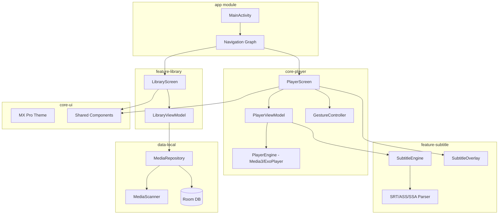

# NextGen Media Player — Implementation Plan

A modern, ad-free, high-performance local media player for Android with VLC-like capabilities and MX Player Pro-inspired UI.

---

## Architecture Overview

## User Review Required

> [!IMPORTANT]
> **Scope**: This plan implements **v1.0** features — core playback, subtitle engine, gesture controls, and local media browsing. Streaming features (SMB, FTP, Chromecast, DLNA) are deferred to v1.5.

> [!NOTE]
> **Package Name**: `com.nextgen.player` — change if desired.

> [!NOTE]
> **Gradle/SDK**: Targets API 35 (Android 15), min SDK 24 (Android 7.0). Uses Gradle 8.x with Kotlin DSL.

---

## Proposed Changes

### Project Root Configuration

#### [NEW] [settings.gradle.kts](file:///c:/games/MediaPlayer/settings.gradle.kts)
- Root settings with all module includes
- Repository configuration (Google, Maven Central, JitPack)

#### [NEW] [build.gradle.kts](file:///c:/games/MediaPlayer/build.gradle.kts)
- Root build script with plugin aliases (AGP, Kotlin, Hilt, KSP)

#### [NEW] [gradle.properties](file:///c:/games/MediaPlayer/gradle.properties)
- AndroidX, non-transitive R classes, Kotlin code style, JVM target

#### [NEW] [gradle/libs.versions.toml](file:///c:/games/MediaPlayer/gradle/libs.versions.toml)
- Version catalog: Compose BOM, Media3, Hilt, Room, Coroutines, Coil, Navigation

---

### `core-ui` Module — Design System (MX Player Pro Style)

#### [NEW] [core-ui/build.gradle.kts](file:///c:/games/MediaPlayer/core-ui/build.gradle.kts)
- Android library module with Compose dependencies

#### [NEW] [Theme.kt](file:///c:/games/MediaPlayer/core-ui/src/main/java/com/nextgen/player/ui/theme/Theme.kt)
- Dark-first Material 3 theme with MX Player Pro-inspired orange accent and deep dark backgrounds

#### [NEW] [Color.kt](file:///c:/games/MediaPlayer/core-ui/src/main/java/com/nextgen/player/ui/theme/Color.kt)
- Color palette: dark surfaces, vibrant orange accents, player overlay colors

#### [NEW] [Type.kt](file:///c:/games/MediaPlayer/core-ui/src/main/java/com/nextgen/player/ui/theme/Type.kt)
- Typography using Google Fonts (Inter/Outfit)

#### [NEW] [PlayerIcons.kt](file:///c:/games/MediaPlayer/core-ui/src/main/java/com/nextgen/player/ui/components/PlayerIcons.kt)
- Custom player control icons and reusable icon button composables

---

### `data-local` Module — Storage & Database

#### [NEW] [data-local/build.gradle.kts](file:///c:/games/MediaPlayer/data-local/build.gradle.kts)
- Android library with Room, Hilt

#### [NEW] [MediaEntity.kt](file:///c:/games/MediaPlayer/data-local/src/main/java/com/nextgen/player/data/local/entity/MediaEntity.kt)
- Room entity: id, path, title, duration, lastPosition, thumbnailUri, dateAdded, size, mimeType

#### [NEW] [PlaybackHistoryEntity.kt](file:///c:/games/MediaPlayer/data-local/src/main/java/com/nextgen/player/data/local/entity/PlaybackHistoryEntity.kt)
- Room entity: mediaId, lastPosition, lastPlayedAt, playCount

#### [NEW] [MediaDao.kt](file:///c:/games/MediaPlayer/data-local/src/main/java/com/nextgen/player/data/local/dao/MediaDao.kt)
- DAO with queries: getAllMedia, getRecentlyPlayed, searchByTitle, updatePlaybackPosition

#### [NEW] [AppDatabase.kt](file:///c:/games/MediaPlayer/data-local/src/main/java/com/nextgen/player/data/local/AppDatabase.kt)
- Room database with entities, migrations

#### [NEW] [MediaScanner.kt](file:///c:/games/MediaPlayer/data-local/src/main/java/com/nextgen/player/data/local/scanner/MediaScanner.kt)
- Scoped storage MediaStore query for video files
- Extracts metadata: title, duration, resolution, size

#### [NEW] [MediaRepository.kt](file:///c:/games/MediaPlayer/data-local/src/main/java/com/nextgen/player/data/local/repository/MediaRepository.kt)
- Repository combining MediaScanner + Room DAO
- Provides Flow-based data access

#### [NEW] [DatabaseModule.kt](file:///c:/games/MediaPlayer/data-local/src/main/java/com/nextgen/player/data/local/di/DatabaseModule.kt)
- Hilt module providing database and DAO instances

---

### `core-player` Module — ExoPlayer/Media3 Engine

#### [NEW] [core-player/build.gradle.kts](file:///c:/games/MediaPlayer/core-player/build.gradle.kts)
- Android library with Media3 (ExoPlayer, UI, Session, DASH, HLS)

#### [NEW] [PlayerEngine.kt](file:///c:/games/MediaPlayer/core-player/src/main/java/com/nextgen/player/player/PlayerEngine.kt)
- Wraps Media3 ExoPlayer
- Hardware accelerated decoding (MediaCodec)
- Software fallback
- Methods: play, pause, seekTo, setSpeed, setABRepeat, toggleLoop
- Resume from last position support

#### [NEW] [GestureController.kt](file:///c:/games/MediaPlayer/core-player/src/main/java/com/nextgen/player/player/gesture/GestureController.kt)
- Left vertical swipe → brightness
- Right vertical swipe → volume
- Horizontal swipe → seek (with preview)
- Double tap → play/pause
- Pinch to zoom (fit/fill/16:9/4:3)
- Long press → 2x speed

#### [NEW] [AudioEngine.kt](file:///c:/games/MediaPlayer/core-player/src/main/java/com/nextgen/player/player/audio/AudioEngine.kt)
- Audio boost (up to 300% via LoudnessEnhancer)
- Audio delay sync adjustment
- External audio track loading
- DTS/Dolby passthrough config

#### [NEW] [PlayerModule.kt](file:///c:/games/MediaPlayer/core-player/src/main/java/com/nextgen/player/player/di/PlayerModule.kt)
- Hilt module providing PlayerEngine, GestureController, AudioEngine

---

### `feature-subtitle` Module — Subtitle Engine

#### [NEW] [feature-subtitle/build.gradle.kts](file:///c:/games/MediaPlayer/feature-subtitle/build.gradle.kts)
- Android library with Compose

#### [NEW] [SubtitleParser.kt](file:///c:/games/MediaPlayer/feature-subtitle/src/main/java/com/nextgen/player/subtitle/SubtitleParser.kt)
- Parses SRT, ASS/SSA formats
- Returns list of `SubtitleCue(startMs, endMs, text, style)`

#### [NEW] [SubtitleRenderer.kt](file:///c:/games/MediaPlayer/feature-subtitle/src/main/java/com/nextgen/player/subtitle/SubtitleRenderer.kt)
- Compose overlay rendering subtitles on video surface
- Configurable font size, color, background, outline

#### [NEW] [SubtitleSyncManager.kt](file:///c:/games/MediaPlayer/feature-subtitle/src/main/java/com/nextgen/player/subtitle/SubtitleSyncManager.kt)
- Manual offset adjustment (±10s in 50ms steps)

---

### `feature-library` Module — Media Browser

#### [NEW] [feature-library/build.gradle.kts](file:///c:/games/MediaPlayer/feature-library/build.gradle.kts)
- Android library with Compose, Hilt, Navigation

#### [NEW] [LibraryScreen.kt](file:///c:/games/MediaPlayer/feature-library/src/main/java/com/nextgen/player/library/ui/LibraryScreen.kt)
- Tab layout: All Videos | Folders | Recent
- Grid/list toggle
- Sorting (name, date, size, duration)
- Search bar
- Thumbnail grid with duration badges, resume indicators

#### [NEW] [FolderScreen.kt](file:///c:/games/MediaPlayer/feature-library/src/main/java/com/nextgen/player/library/ui/FolderScreen.kt)
- Browse media by folder structure

#### [NEW] [LibraryViewModel.kt](file:///c:/games/MediaPlayer/feature-library/src/main/java/com/nextgen/player/library/viewmodel/LibraryViewModel.kt)
- Manages media list state, search, sorting, scan trigger

#### [NEW] [MediaItemCard.kt](file:///c:/games/MediaPlayer/feature-library/src/main/java/com/nextgen/player/library/ui/components/MediaItemCard.kt)
- Card composable: thumbnail, title, duration, resolution badge, progress bar

---

### `app` Module — Application Shell

#### [NEW] [app/build.gradle.kts](file:///c:/games/MediaPlayer/app/build.gradle.kts)
- Application module, depends on all feature/core modules
- Hilt Android plugin, Compose, KSP

#### [NEW] [AndroidManifest.xml](file:///c:/games/MediaPlayer/app/src/main/AndroidManifest.xml)
- Permissions: READ_MEDIA_VIDEO, READ_EXTERNAL_STORAGE (legacy), INTERNET
- Activity declarations, intent filters for video files

#### [NEW] [NextGenApp.kt](file:///c:/games/MediaPlayer/app/src/main/java/com/nextgen/player/NextGenApp.kt)
- Application class with `@HiltAndroidApp`

#### [NEW] [MainActivity.kt](file:///c:/games/MediaPlayer/app/src/main/java/com/nextgen/player/MainActivity.kt)
- `@AndroidEntryPoint`, edge-to-edge, runtime permission handling

#### [NEW] [PlayerActivity.kt](file:///c:/games/MediaPlayer/app/src/main/java/com/nextgen/player/PlayerActivity.kt)
- Dedicated fullscreen player activity
- Landscape, immersive mode, keep screen on
- Hosts player composable with gesture overlay

#### [NEW] [NavGraph.kt](file:///c:/games/MediaPlayer/app/src/main/java/com/nextgen/player/navigation/NavGraph.kt)
- Navigation: Library → Player, Settings

#### [NEW] [PlayerScreen.kt](file:///c:/games/MediaPlayer/app/src/main/java/com/nextgen/player/ui/PlayerScreen.kt)
- Full player UI composable:
  - Video surface (Media3 PlayerView)
  - Top bar (title, back, subtitle, audio track)
  - Bottom bar (play/pause, seek bar, time, speed, lock)
  - Gesture overlay for brightness/volume/seek
  - Subtitle overlay

#### [NEW] [PlayerViewModel.kt](file:///c:/games/MediaPlayer/app/src/main/java/com/nextgen/player/ui/PlayerViewModel.kt)
- Manages ExoPlayer lifecycle, playback state, subtitle state

#### [NEW] [SettingsScreen.kt](file:///c:/games/MediaPlayer/app/src/main/java/com/nextgen/player/ui/SettingsScreen.kt)
- Player defaults (speed, decoder, resume)
- Subtitle defaults (font, size, color)
- Appearance (theme, grid size)

#### [NEW] [AppModule.kt](file:///c:/games/MediaPlayer/app/src/main/java/com/nextgen/player/di/AppModule.kt)
- Root Hilt module

---

### Resources & Drawables

#### [NEW] [res/values/strings.xml](file:///c:/games/MediaPlayer/app/src/main/res/values/strings.xml)
- App name, player labels, settings labels

#### [NEW] [res/values/themes.xml](file:///c:/games/MediaPlayer/app/src/main/res/values/themes.xml)
- Base theme for splash/system bars

#### [NEW] App icon
- Launcher icon in mipmap directories (placeholder vector)
