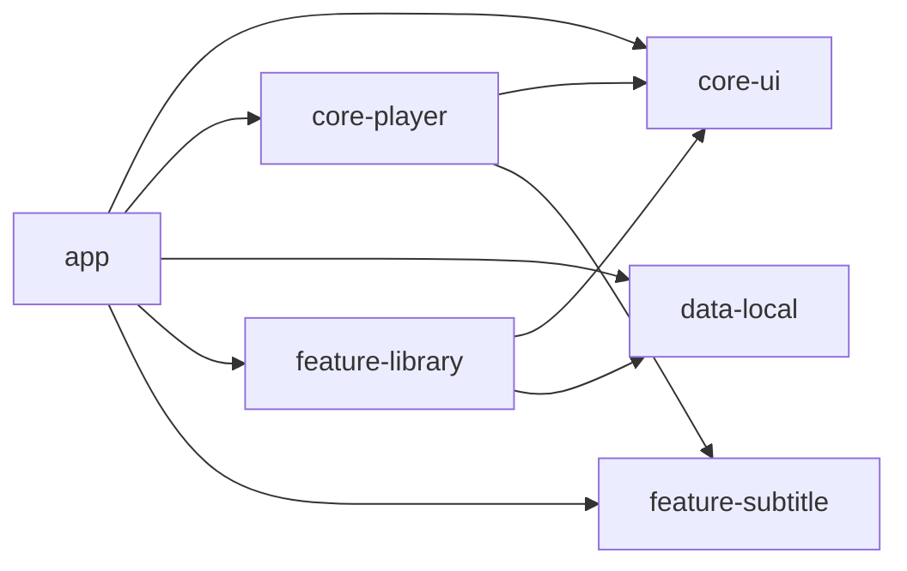

# NextGen Media Player — Walkthrough

## ✅ Project Complete

Successfully created the full **NextGen Media Player** Android project at `c:\games\MediaPlayer` with **55 files** across **6 modules**.

---

## Architecture

---

## Module Summary

| Module | Files | Purpose |
|--------|-------|---------|
| **app** | 12 | Activities, NavGraph, PlayerScreen, Settings |
| **core-ui** | 4 | MX Pro theme, colors, typography, icons |
| **core-player** | 4 | ExoPlayer engine, gestures, audio engine, DI |
| **data-local** | 6 | Room DB, MediaStore scanner, repository, DI |
| **feature-library** | 4 | Library UI (grid/list/folders), ViewModel |
| **feature-subtitle** | 4 | SRT/ASS/SSA parser, overlay, sync manager |

---

## Key Features Implemented

| Feature | Implementation |
|---------|---------------|
| 🎬 **Playback** | ExoPlayer/Media3 with HW acceleration, resume, speed (0.25x–3x), A-B repeat, loop |
| 🎛 **Gestures** | Brightness (left swipe), volume (right swipe), seek (horizontal), double-tap play/pause, pinch zoom, lock |
| 💬 **Subtitles** | SRT, ASS/SSA, MicroDVD SUB parsing; Compose overlay; sync ±10s in 50ms steps |
| 🎵 **Audio** | LoudnessEnhancer boost up to 300%, audio delay sync, external track loading |
| 📁 **Library** | MediaStore scanner, Room DB, tabs (All/Folders/Recent/Favorites), grid/list toggle, search, sort |
| 🎨 **UI** | Material 3 dark theme with orange accents, video thumbnails via Coil, resolution/duration badges |
| 🔒 **Privacy** | No ads, no trackers, offline-first, scoped storage |

---

## Next Steps

### To Build the APK
1. Open `c:\games\MediaPlayer` in **Android Studio**
2. Click **Sync Now** when prompted for Gradle sync
3. Run `./gradlew assembleDebug` or click ▶️ to build and run

### Manual Testing
1. Grant video file access permission on first launch
2. Browse videos → Tap to play → Test gesture controls
3. Test subtitle loading (MKV with embedded subs)
4. Test playback speed, loop, and resume
